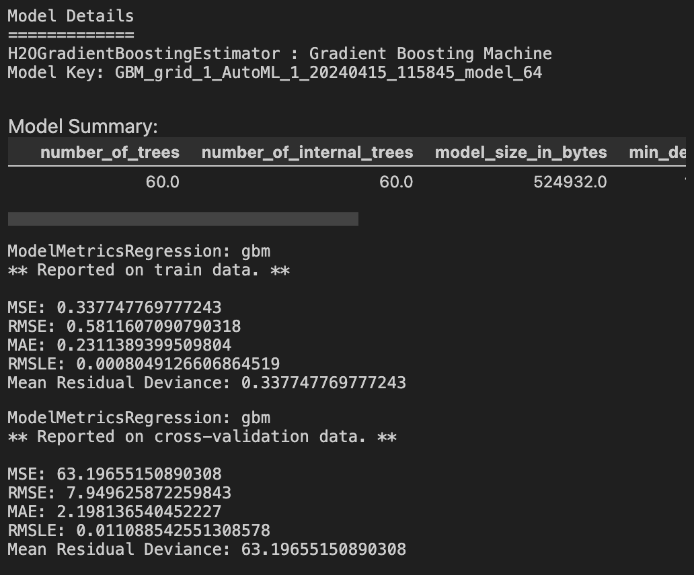
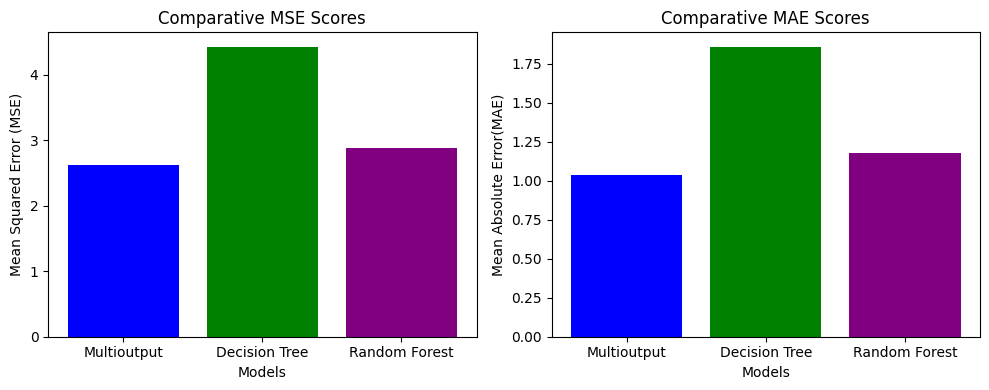

# Flood Prediciton using meteo- and hydro- data in Ekidin station, Kostanay, Kazakhstan 

This project predicts water levels in Ekidin station, Kostanay Resion, Kazakhstan bases on meteo and hydro data from 2014-01-01 until 12-31-2020. 
The project was motivated by National Flood Crisis that has been taking place in Kazakhstan since March 29th, 2024. 

## Data

The raw data was pulled from The National Hydrometeorological Service of Kazakhstan data base 
* https://www.kazhydromet.kz/en/

## Packages

The key Python packages used in this project are:

**Data Manipulation and Analysis**:
- pandas
- numpy
- matplotlib
- seaborn

**Machine Learning**:
- sklearn.datasets
- sklearn.multioutput.MultiOutputRegressor
- sklearn.linear_model.ElasticNet
- sklearn.tree.DecisionTreeRegressor
- sklearn.ensemble.RandomForestRegressor

**Model Evaluation**:
- sklearn.metrics.mean_squared_error
- sklearn.metrics.mean_absolute_error

**Preprocessing**:
- sklearn.preprocessing.StandardScaler
- sklearn.preprocessing.RobustScaler
- sklearn.model_selection.train_test_split

**Model Training**:
- tensorflow
- tensorflow.keras.models.Sequential
- tensorflow.keras.layers.Dense
- tensorflow.keras.layers.Dropout
- tensorflow.keras.optimizers.Adam

**Miscellaneous Utils**:
- joblib.dump
- joblib.load

### Data Wrangling

1. **Join**: Hydrology and Meteo features were joined
2. **Imputation**: Hydro data had very little missingness that was imputed through finding the average of neighboring dates or filled in with 0 based on the nature of missing point. Meteo data was mostly imputed in the same fashion. Precipitation data had large periods of missingness that was imputed using a Deep Learning Model trained on non-temporal weather attributes. 
4. **Feature generation**: Additonal features were generated through aggregation functions and sliding windows 
5. **Train Test Split**: 80-20 stratified split based on continous period to form training and testing sets
   [Historical water levels in Ekidin station for the time period chosen for this exploration](figures/historical_water_levels.png) 

## Modeling

Two main ML approaches were tested in this project:

1. **Time Series Forecast**: 
   - **Overview**: The project explored the use of AutoML tools, with a particular focus on the H2O platform. The H2O's Gradient Boosting Machine (GBM) was utilized to forecast future values in a time series setting.
   - **Objective**: The model aimed to predict the water levels for the next day using historical data.
   - **Results**: The model's performance was evaluated based on standard metrics such as Mean Absolute Error (MAE) and Mean Squared Error (MSE).
   - **Visualization**:
      

2. **Multi-output regression**:
   - **Overview**: This method involved the application of three common multi-output regression models: the Multioutput Regressor, Decision Tree, and Random Forest models.
   - **Objective**: The aim was to predict water levels for the next seven days.
   - **Model Comparison**: The models were compared based on their MAE and MSE scores to determine the most effective approach.
   - **Selected Model**: Based on the comparative analysis, the Multioutput Regressor model was selected for the final predictions.
   - **Visualization**:
      

## Results  

Based on the analysis conducted, the primary challenge encountered was prolonged periods of missing data, which are crucial for accurate flood prediction. I attempted to use st-GNN for data imputation; however, st-GNN requires several locations with overlapping periods free of missing data. In this dataset, such a condition was met for only six days, despite having data from four additional stations. Consequently, it was decided to employ non-temporal deep learning models that use combinations of meteorological data to approximate precipitation values.

Despite these challenges, the final models based on multi-output regression and time series forecasting demonstrated potential in alerting analysts to potential flood events.

Particularly, the multi-output regression model utilized data from the previous seven days—during which water levels were very low—to predict a significant rise in water levels on March 24th, 2020, as depicted in the graph in blue.

On the other hand, the time series forecast model, even when using in-sample testing, failed to provide accurate indications of the impending flood event.

Overall, although these approaches are simplified, they still function as viable tools for flood prediction up to seven days in advance. In the future, integrating Sentinel data with geographic information systems (geogifs) could enhance prediction accuracy through a combination of machine learning and physical models.

 

## Status 
Project is: complete

## Contact 
* zxu4@case.edu

## Acknowledgements 
* Kazhydromet 
